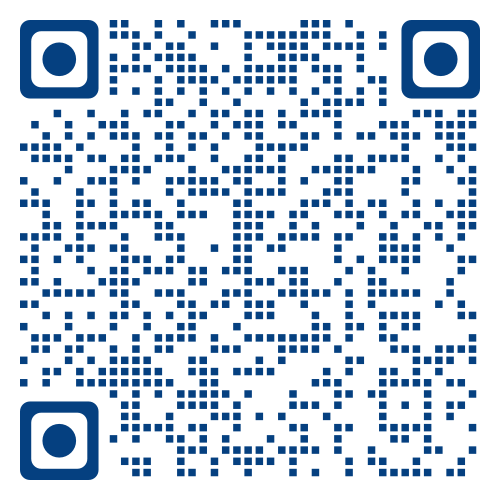

**Augmented Reality (AR) - Image Tracking**
-----------------------------------------------------------------------
Augmented Reality (AR) adalah teknologi yang menampilkan konten digital ke dunia nyata, meningkatkan persepsi dan interaksi pengguna dengan lingkungannya. Augmented Reality (AR) menyempurnakan dunia nyata dengan implementasi media digital, seperti gambar, video/model 3D, ke lingkungan nyata melalui perangkat seperti ponsel cerdas, tablet, atau kacamata AR.
-------------------------------------------------------------------------
**Marker**
-----------------------------------------------------------------------
Klik di sini untuk download marker yang digunakan--> [assets/KartuFF.pdf]
-----------------------------------------------------------------------
**Guide**
--------------------------------------------------------------------
1. Download marker yang sudah disediakan di halaman cardAR
2. Buka halaman DemoAR dan klik "Start" untuk memulai Images Tracking
3. Berikan izin kamera pada perangkat yang digunakan
4. Scan marker sampai perangkat mendeteksi gambar berupa 3D
-------------------------------------------------------------------
**QR-Code**
----------------------------------------------------------------
 
